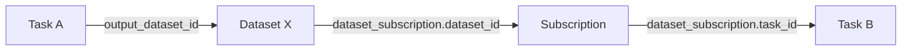
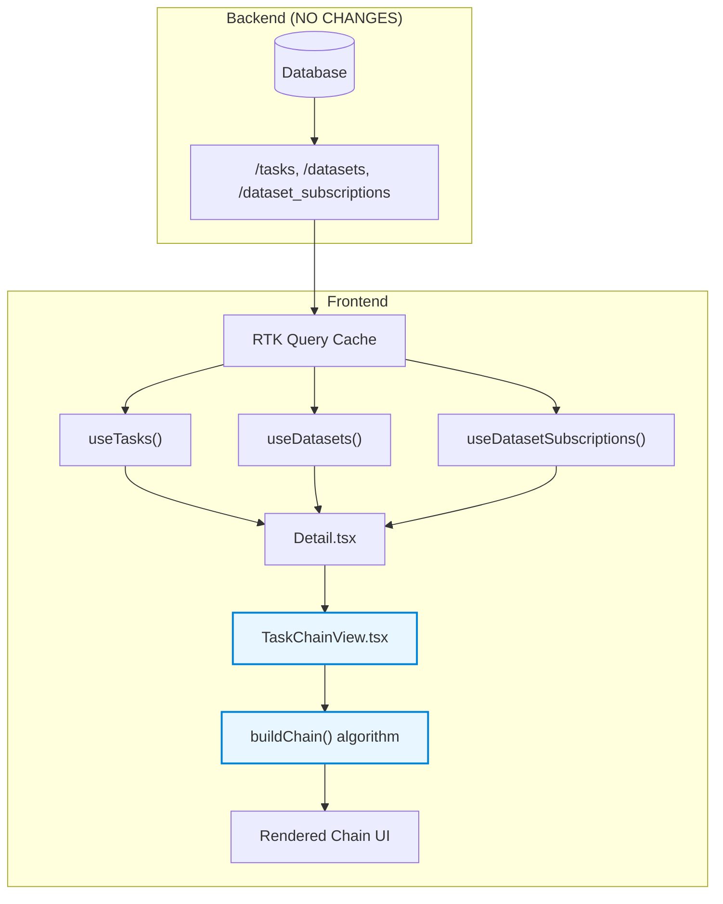

# Task Chain Visualization — Implementation Guide

## 1. What We're Building

A **dual visualization system** for task pipelines on the Karya Admin Portal. When an operator opens any task's detail page, they see the relevant flow for that task type, automatically discovered from the database or task parameters.

### Visualization 1: Data Pipeline (`TaskChainView`)
Used for projects where tasks pass data to each other.


### Visualization 2: User Journey Sequence (`TaskSequenceView`)
Used for projects like **Persuasion** where the flow is dictated by a sequential array of task IDs in the user's journey, rather than data handoffs.


### Visualization 3: Full Chain View (Tasks 3–5)


**Key behaviors:**
- **Dynamic** — computed in real-time from live API data (`dataset_subscriptions`) or task parameters (`params.sequence`).
- **Contextual** — The current task is **bold + highlighted** with an emphasized border/background.
- **Interactive** — Every node/step is **clickable**, navigating to the respective task or dataset.
- **Responsive** — Horizontally scrolls for long pipelines.
- **Smart Formatting** — Handles complex Fan-In merging and gracefully handles standalone tasks.

---

## 2. What We Already Have (Existing Infrastructure)

The Karya platform already has everything needed in the backend and frontend — **zero backend changes required**.

### 2.1 Database Entities (Already Exist)

| Entity | Key Fields | Role |
|--------|-----------|------|
| `task` | `id`, `name`, `output_dataset_id` | Each task optionally writes output to a dataset |
| `dataset` | `id`, `name` | Stores datapoints (input/output data) |
| `dataset_subscription` | `task_id`, `dataset_id` | Links a task to the dataset it consumes |

### 2.2 Backend API Endpoints (Already Exist)

| Endpoint | Returns | Used By |
|----------|---------|---------|
| `GET /tasks` | All tasks in the project | `useTasks()` hook |
| `GET /datasets` | All datasets in the project | `useDatasets()` hook |
| `GET /dataset_subscriptions` | All subscriptions (optionally filtered by `task_id`) | `useDatasetSubscriptions()` hook |

### 2.3 Frontend Hooks (Already Exist)

All defined in `server/frontend/src/hooks/Data.ts`:

```typescript
// Already exists — fetches all tasks
export function useTasks() {
  const { data } = backendApi.useGetAllTasksQuery();
  return data ?? [];
}

// Already exists — fetches all datasets
export function useDatasets({ exclude }: { exclude?: string[] }) {
  const { data } = backendApi.useGetAllDatasetsQuery();
  return data;
}

// Already exists — fetches subscriptions, optionally by task_id
export function useDatasetSubscriptions(task_id?: string) {
  const { data } = backendApi.useGetDatasetSubscriptionsQuery(task_id);
  return data;
}
```

### 2.4 How Chaining Works in the Database



**Chain discovery pattern:** `Task → output_dataset → subscription → next_task → repeat`

---

## 3. What We Need to Build (2 Files)

### File 1: `TaskChainView.tsx` (NEW)

**Location:** `server/frontend/src/screens/tasks/TaskChainView.tsx`

This is the core component. It contains:

#### 3.1 The `buildChain()` Algorithm

A pure function that takes all tasks, datasets, and subscriptions and computes the chain:

```
STEP 1: Build lookup maps (O(n))
  - taskById:            task.id → task
  - datasetById:         dataset.id → dataset  
  - subsByDataset:       dataset_id → subscriptions that consume this dataset
  - subsByTask:          task_id → subscriptions for this task
  - taskByOutputDataset: dataset_id → task that produces this dataset

STEP 2: Walk BACKWARDS to find root task
  Starting from currentTask:
    → Find its subscription → find the dataset it subscribes to
    → Find the task that produces that dataset (via output_dataset_id)
    → Repeat until no upstream task exists
  Result: rootTaskId (the first task in the chain)

STEP 3: Walk FORWARDS to build the chain
  Starting from rootTask:
    → Add input dataset (if root subscribes to one)
    → Add task node
    → Add output dataset (task.output_dataset_id)
    → Find subscription to that output dataset
    → Follow to next task → repeat
  Result: ChainNode[] (ordered list of tasks and datasets)
```

**Cycle protection:** Both walks use `Set<string>` to prevent infinite loops.

#### 3.2 The `ChainNodeBox` Component

Renders a single node (task or dataset):

| Property | Task Node | Dataset Node |
|----------|-----------|-------------|
| Border color | `techBlue` (#0082D7) | `impactGreen` (#41B47D) |
| Icon |  `FaTasks` |  `FaDatabase` |
| Current task | Bold text + 3px border + #E8F6FF background | N/A |
| Regular | Medium text + 1.5px border + white background | Same |
| Hover | Lifts up 2px + shadow | Same |
| Click | Navigate to `/tasks/{id}` | Navigate to `/datasets/{id}` |

#### 3.3 The `TaskChainView` and `TaskSequenceView` Exports

The file exports two components. 

**`TaskChainView`** (Data Pipeline):
```typescript
{
  currentTaskId: string;          // From URL params
  tasks: TaskRecord[];            // From useTasks()
  datasets: DatasetRecord[];      // From useDatasets()
  subscriptions: DatasetSubscriptionRecord[];  // From useDatasetSubscriptions(undefined)
}
```

**`TaskSequenceView`** (User Journey):
```typescript
{
  currentTaskId: string;   // From URL params
  sequence: string[];      // Array of task IDs from task.params.sequence
  allTasks: TaskRecord[];  // From useTasks()
}
```

### File 2: `Detail.tsx` (MODIFY — 3 small changes)

**Location:** `server/frontend/src/screens/tasks/Detail.tsx`

#### Change 1: Add imports and data fetching

```diff
+import { useTasks } from '@/hooks/Data';
+import { TaskChainView, TaskSequenceView } from './TaskChainView'; 
```

#### Change 2: Fetch chain data (inside `TaskDetail` function)

```diff
  const datasets = useDatasets({});
+ const { data: taskFullData } = backendApi.useGetTaskByIdQuery(task_id as string, { skip: !task_id });
+ const allTasks = useTasks();
+ const allSubscriptions = useDatasetSubscriptions(undefined);
```

#### Change 3: Render the sections (before "Current Subscriptions")

```diff
+     {/* Task Chain Visualization */}
+     {datasets && allTasks.length > 0 && allSubscriptions && (
+       <Section heading="Task Chain" level="l2" noDivider>
+         <TaskChainView currentTaskId={task_id} tasks={allTasks} datasets={datasets} subscriptions={allSubscriptions} />
+       </Section>
+     )}
+
+     {/* Task Sequence Visualization — only if sequence array exists */}
+     {taskFullData?.params?.sequence && Array.isArray(taskFullData.params.sequence) && taskFullData.params.sequence.length > 0 && (
+       <Section heading="Task Sequence (User Journey)" level="l2" noDivider>
+         <TaskSequenceView currentTaskId={task_id!} sequence={taskFullData.params.sequence} allTasks={allTasks} />
+       </Section>
+     )}
 
      <Section heading="Current Subscriptions" level="l2" noDivider>
```

---

## 4. Step-by-Step Implementation Checklist

### Phase 1: Create the Component

- [ ] Create `server/frontend/src/screens/tasks/TaskChainView.tsx`
- [ ] Define `ChainNode` interface (`id`, `type`, `name`)
- [ ] Implement `buildChain()` function with backward + forward traversal
- [ ] Implement `ChainNodeBox` component with task/dataset styling
- [ ] Implement `ChainArrow` component (→ connector)
- [ ] Implement `TaskChainView` export with `useMemo` for chain computation
- [ ] Add empty state: "No connected tasks found in the chain"

### Phase 2: Integrate into Detail Page

- [ ] Add `useTasks` to the import block from `@/hooks/Data`
- [ ] Add `import { TaskChainView } from './TaskChainView'`
- [ ] Add `const allTasks = useTasks()` in `TaskDetail()`
- [ ] Add `const allSubscriptions = useDatasetSubscriptions(undefined)` in `TaskDetail()`
- [ ] Add `<Section heading="Task Chain">` with `<TaskChainView>` before Current Subscriptions
- [ ] Wrap in conditional: only render when data is loaded

### Phase 3: Test

- [ ] Navigate to a task with chained subscriptions → verify chain renders
- [ ] Verify current task is bold + highlighted
- [ ] Click a node → verify navigation works
- [ ] Check a standalone task (no chain) → verify "No connected tasks" message
- [ ] Scroll horizontally on a long chain → verify overflow works
- [ ] Build production bundle: `npm run build` (in `server/frontend`)

---

## 5. Dependencies

| Dependency | Status | Notes |
|------------|--------|-------|
| `@chakra-ui/react` | ✅ Already installed | `Box`, `HStack`, `VStack`, `Text`, `Icon` |
| `react-icons/fa` | ✅ Already installed | `FaArrowRight`, `FaDatabase`, `FaTasks` |
| `react-router-dom` | ✅ Already installed | `useNavigate` |
| `@karya/core` | ✅ Already installed | `TaskRecord`, `DatasetRecord`, `DatasetSubscriptionRecord` |
| `@/themes/Attributes` | ✅ Already exists | `ColorMap` for consistent styling |
| `@/hooks/Data` | ✅ Already exists | `useTasks`, `useDatasets`, `useDatasetSubscriptions` |
| Backend API changes | ❌ Not needed | Uses existing endpoints |
| Database migrations | ❌ Not needed | Uses existing tables |

**Total new dependencies: 0**

---

## 6. Architecture Summary



---

## 7. Current Status

| Item | Status |
|------|--------|
| `TaskChainView.tsx` | ✅ Created — fully implemented |
| `Detail.tsx` changes | ✅ Applied — imports, hooks, and section added |
| Backend changes | ❌ Not needed |
| Testing on live platform | ⏳ Pending — needs platform login credentials |
| Static demo | ✅ Available at `chain-demo.html` |

---

## 8. File Structure

```
server/frontend/src/screens/tasks/
├── TaskChainView.tsx    ← NEW (chain visualization component)
├── Detail.tsx           ← MODIFIED (3 small additions)
└── ...existing files

leyu/
├── README.md            ← This file
├── chain-demo.html      ← Static demo (no backend needed)
├── [REC] Task 1 (1).json
├── [REC] Task 2 (Validation of Task 1).json
├── [REC] Task 3 (Validation of Task 2).json
└── Task 1 Dataset.json
```

---

## Appendix: Live HTML Source (For PDF/Renderers)
If you are viewing this manually or need the HTML, view it here: [Live HTML Source](./chain-demo.html)
